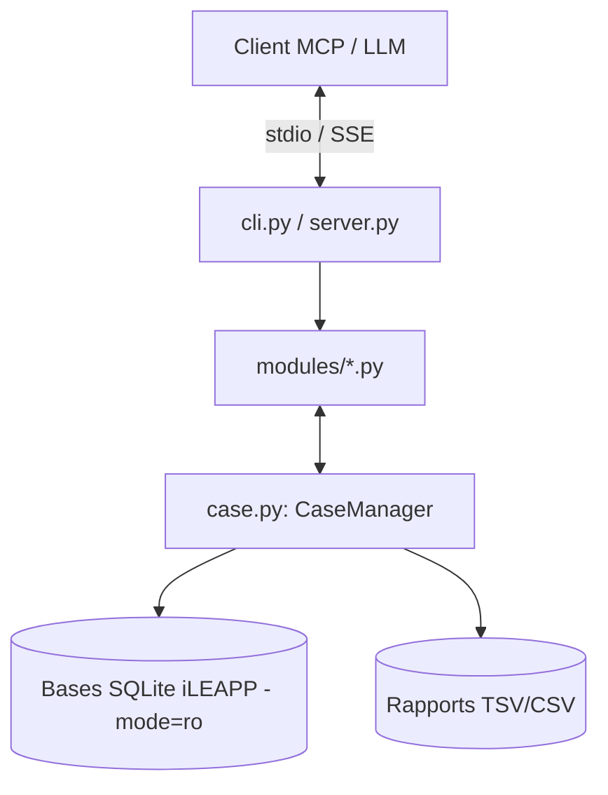

# 🛠️ Documentation Technique & Architecture Développeur : iLEAPP-MCP

Ce document détaille les choix d'architecture, la structure interne du code, les flux de données et les bonnes pratiques implémentées sur le serveur **iLEAPP-MCP**.

---

## 🏗️ 1. Vue d'Ensemble & Philosophie d'Architecture

Le projet agit comme une passerelle entre un **LLM / Client MCP** (Claude Desktop, Cursor, Custom Agents) et les **données forensiques générées par iLEAPP** (extractions Full File System, GrayKey, iTunes sur iOS).

### Principes Clés :
1. **Modèle Non-Intrusif & Immuable (Read-Only)** : Les preuves numériques ne doivent jamais être altérées. Toutes les connexions SQLite sont ouvertes en URI avec `?mode=ro`.
2. **Découplage Serveur / Logique Métier** : Le serveur MCP (`server.py`) n'implémente aucune logique forensique ; il se contente d'exposer via des décorateurs `@mcp.tool()` des modules spécialisés (`modules/`).
3. **Protection de Contexte LLM (Anti-Token Explosion)** : Pagination obligatoire et encadrée (par défaut 50 items, max 250/500 items) avec curseurs `total_count`, `has_more` et `next_offset`.
4. **Tolérance aux Variations iLEAPP (`_find_field`)** : iLEAPP génère selon ses plugins des colonnes hétérogènes (ex: `Message Date` en TSV vs `message_date` en SQLite). Une couche de normalisation dynamique mappe ces champs sans casser les requêtes.

---

## 📁 2. Arborescence du Code Source

```text
iLEAPP-MCP/
├── .github/workflows/ci.yml       # Pipeline CI/CD GitHub Actions (Lint, Typecheck, Test multi-Python)
├── agents/                        # System Prompts prêts à l'emploi pour les LLMs
│   ├── analyste_forensic.md       # Persona Analyste Généraliste
│   └── profileur_comportemental.md# Persona Profileur d'habitudes / Psychologie
├── src/ileapp_mcp/
│   ├── __init__.py                # Package version
│   ├── cli.py                     # Point d'entrée CLI (ileapp-mcp) avec gestion des flags et du transport
│   ├── server.py                  # Instanciation FastMCP et enregistrement des @mcp.tool()
│   ├── case.py                    # CaseManager (Indexation, Cache de connexions, Sécurité SQL)
│   ├── models.py                  # Schémas Pydantic typés (MessageRecord, CallRecord, etc.)
│   └── modules/                   # Parsers & Analyseurs spécialisés par domaine
│       ├── apps.py                # Applications installées & permissions
│       ├── calls.py               # Historique d'appels & durées
│       ├── device_info.py         # Métadonnées matériel, OS et acquisition
│       ├── generic.py             # Découverte d'artefacts & exécution SQL brute sécurisée
│       ├── health.py              # Santé, podomètre, sommeil, rythme cardiaque
│       ├── locations.py           # Positions GPS & calcul de rayon Haversine
│       ├── messages.py            # Messageries unifiées (SMS, iMessage, WhatsApp, Signal...)
│       ├── networks.py            # Wi-Fi, Bluetooth, Cell Towers et AirDrop
│       ├── notes.py               # Notes, mémos vocaux et calendrier
│       ├── photos.py              # Métadonnées photos, EXIF (GPS) et Corbeille
│       ├── system_state.py        # Événements système (Batterie, Verrouillage, Biome/KnowledgeC)
│       ├── timeline.py            # Timeline chronologique agrégée
│       └── web.py                 # Navigation Safari/Chrome, requêtes de recherche
├── tests/                         # Suite de tests Pytest (Couverture ~74%)
│   ├── fixtures/
│   │   └── generate_mock_ileapp.py# Générateur synthétique d'extraction GrayKey FFS
│   └── test_*.py                  # Tests unitaires et d'intégration E2E
└── pyproject.toml                 # Définition des dépendances & packaging (Hatchling)
```

---

## ⚙️ 3. Composants Centraux



### 3.1. `CaseManager` (`src/ileapp_mcp/case.py`)
Le **cœur d'accès aux données**. Il gère :
* **Découverte & Indexation** : Détecte les sous-dossiers `_iLEAPP_Reports_*` et indexe l'ensemble des fichiers `.sqlite`, `.db`, `.tsv` et `.csv` dans un dictionnaire mémoire (`stem -> Path`).
* **Protection DoS** : Limite l'exploration à 50 000 fichiers pour éviter le blocage lors d'un scan de dossier racine.
* **Pool de Connexions SQLite Thread-Safe** : Caches de connexions par base, configurées avec `check_same_thread=False` et `row_factory = sqlite3.Row`.
* **Protection DoS** : Limite l'exploration à 50 000 fichiers pour éviter le blocage lors d'un scan de dossier racine.
* **Pool de Connexions SQLite Thread-Safe** : Caches de connexions par base, configurées avec `check_same_thread=False` et `row_factory = sqlite3.Row`.
* **Générateurs à Empreinte Mémoire Nulle (Lazy-Yielding)** : Fournit `iter_sqlite_rows` et `iter_tsv_rows` qui streamment les lignes au lieu de charger les 100 000 entrées d'une table avec `fetchall()`.
* **Réservoir Borné en Mémoire ($O(1)$ RAM)** : Dans chaque module, les enregistrements sont évalués, filtrés et dédupliqués à la volée. La mémoire vive allouée est strictement bornée à `offset + limit` éléments, garantissant l'absence totale d'Out-Of-Memory (OOM) même sur des bases géantes de 10 Go+.
* **Sérialisation Sûre RFC 8259** : Les données binaires (BLOBs SQLite) sont automatiquement tronquées et converties en chaînes hexadécimales lisibles. Les coordonnées géographiques et valeurs numériques sont validées contre `NaN` et `Infinity` pour ne jamais corrompre le parseur JSON du client MCP.
* **Résilience aux Clients Stateless** : Le chemin de l'extraction active est sauvegardé dans `.ileapp_mcp_last_case` (répertoire temporaire système), permettant aux clients MCP qui redémarrent le processus en mode stdio (comme Charm Crush) de conserver l'état du cas en toute transparence.
* **Estimateur de Pagination SQL** : `query_sqlite` intercepte les requêtes pour calculer le `COUNT(*)` sans double-pagination et injecte `LIMIT/OFFSET` de façon transparente.
* **Parsing Multi-Encodage** : Lecture résiliente des TSV/CSV avec `errors="replace"` en essayant successivement `utf-8-sig`, `utf-8`, `latin-1` et `cp1252`.

### 3.2. Normalisation Dynamique & Priorité Ordinale : `_find_field`
Chaque module forensique utilise une fonction de matching de colonne insensible à la casse et aux séparateurs, respectant l'ordre de priorité strict des alias définis par le développeur :
```python
def _find_field(keys: list[str], raw: dict[str, Any]) -> Any | None:
```
* **Passe 1 (Priorité exacte ordonnée)** : Évalue les colonnes candidates dans l'ordre de la liste `keys`, garantissant que les colonnes primaires priment sur les alias de secours (ex: `"Value"` avant `"State"`).
* **Passe 2 (Sous-chaîne)** : Correspondance partielle pour les variations de libellés iLEAPP.

### 3.3. Découverte Dynamique de Tables SQLite (`sqlite_master`)
Dans les bases SQLite d'iOS, les tables ne portent jamais le nom du fichier `.db` (ex: `healthdb_secure.sqlite` contient `samples`, `knowledgeC.db` contient `ZOBJECT`). Tous les modules interrogent systématiquement `sqlite_master` (`WHERE type='table' AND name NOT LIKE 'sqlite_%'`) pour découvrir et inspecter dynamiquement l'intégralité des tables internes.

### 3.4. Accélérateur de Timeline : `tl.db` Fast-Path
iLEAPP précompile tous les événements chronologiques dans `_Timeline/tl.db` (table `data(key TEXT, activity TEXT, datalist TEXT)`).
* **Chemin Rapide (Fast-Path)** : Si `tl.db` est présent, `get_timeline` exécute une requête SQL directe (`ORDER BY key ASC LIMIT ? OFFSET ?`), décompresse le JSON de `datalist` et classifie l'activité en temps sub-seconde.
* **Chemin de Secours (Fallback)** : Si `tl.db` est absent, le module agrège dynamiquement les données des 10 modules forensiques.

### 3.5. Calcul Géospatial : Formule de Haversine (`locations.py`)
Le module de localisation embarque l'algorithme mathématique de Haversine directement en Python pur. Cela permet de requêter des coordonnées dans un rayon précis (`radius_km`) autour d'un point central sans nécessiter l'extension SpatiaLite dans SQLite.

### 3.6. Sécurité & Sandbox SQL (`case.py` & `generic.py`)
L'outil `run_readonly_sql` applique une stratégie de **défense en profondeur** :
1. **Contrôle Lexical / Regex** :
   * Requêtes commençant strictement par `SELECT`, `WITH`, `EXPLAIN`, ou certains `PRAGMA`.
   * Rejet des requêtes multiples avec `;`.
   * Liste noire de mots-clés de mutation (`DROP`, `DELETE`, `UPDATE`, `INSERT`, `ALTER`, `ATTACH`, `VACUUM`, etc.).
2. **Contrôle Moteur SQLite** : Connexion forcée en `file:<path>?mode=ro`. Même en cas de contournement du Regex, SQLite lève une erreur système d'écriture.
3. **Assainissement des Noms d'Artefacts** : Suppression des backticks et quotes lors des requêtes sur tables dynamiques.

---

## 🔄 4. Flux Typique d'un Appel MCP

Exemple : Le LLM demande `get_messages(sender="Alice", limit=20)`

1. **`server.py`** : Réception de l'instruction JSON-RPC via `mcp.tool()`.
2. **`modules/messages.py`** : 
   * Interroge le `CaseManager` pour identifier les bases SQLite (`sms.db`, `chat.db`) et les fichiers TSV (`WhatsApp_Messages.tsv`, etc.).
   * Streamme les lignes une par une (`iter_sqlite_rows`, `iter_tsv_rows`).
   * Filtre et normalise chaque ligne en modèle `MessageRecord` à la volée.
   * Déduplique en mémoire (clé : `timestamp + sender + text + app`).
   * Stocke uniquement jusqu'à `offset + limit` enregistrements (réservoir borné).
   * Retourne un objet `PaginatedResult[MessageRecord]`.
3. **`server.py`** : Sérialisation JSON et retour du résultat au LLM.

---

## 🧪 5. Architecture de Test & Intégration Continue (CI/CD)

* **Générateur Mock (`tests/fixtures/generate_mock_ileapp.py`)** : Crée à la volée une fausse extraction GrayKey avec toutes les tables/TSV représentatifs pour tester le serveur sans données réelles sensibles.
* **Pytest Test Suite (`tests/`)** : **51 tests** couvrant :
  * Indexation, auto-reprise stateless et chargement de cas.
  * Validation et blocage des mutations SQL.
  * Découverte dynamique des tables SQLite (`sqlite_master`).
  * Assainissement anti-NaN/Inf et streaming mémoire.
  * Accélérateur `tl.db` pour la timeline.
  * Parsing HTML pour les listes `DeviceInfo.html`.
  * Filtrage métier (dates, rayon Haversine, contacts, bundles, types).
  * Intégration E2E du serveur FastMCP.
* **GitHub Actions (`.github/workflows/ci.yml`)** :
  * Matrice de test sur Python `3.10`, `3.11`, `3.12` et `3.13`.
  * Linting strict avec `ruff check .`
  * Formatage du code avec `ruff format --check .`
  * Type-checking avec `mypy src tests`.

---

## 🚀 6. Guide d'Extension : Ajouter un Nouveau Module Forensique

Pour ajouter un nouveau parser (ex: `health.py` pour Apple Health) :

1. **Créer le modèle dans `models.py`** :
   ```python
   class HealthRecord(BaseModel):
       timestamp: str | None = None
       data_type: str
       value: float | str
       unit: str | None = None
   ```
2. **Créer le module dans `src/ileapp_mcp/modules/health.py`** :
   * Implémenter la logique en exploitant `case.get_sqlite_connection(...)` ou `case.read_tsv_records(...)`.
   * Utiliser `_find_field` pour normaliser les colonnes.
3. **Exposer l'outil dans `server.py`** :
   ```python
   @mcp.tool()
   def get_health_data(...) -> PaginatedResult[HealthRecord]:
       """Documentation pour le LLM."""
       return _get_health_data(case_manager, ...)
   ```
4. **Ajouter le test associé dans `tests/test_health.py`**.
